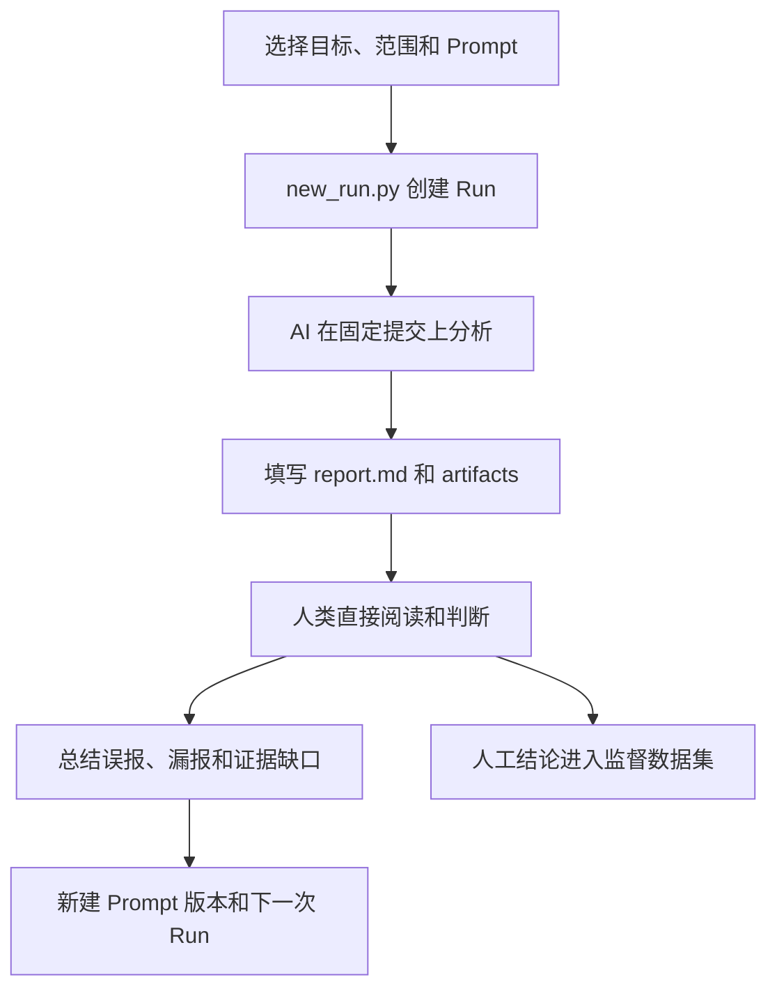

# 当前分析工作流

本文描述仓库当前实际执行的 AI 辅助缺陷分析流程。AI 负责按固定格式写报告，人类直接阅读证据并给出最终判断。

## 总览



工作流只有两个核心产物：

- `manifest.json`：记录本轮实验配置和精确的上游提交。
- `report.md`：AI 的格式化分析和人类的最终评价写在同一份 Markdown 中。

不再需要额外的 Python 校验、JSON review 或自动评分步骤。

## 1. 准备上游版本

仓库管理两个顶层 submodule：

- `upstream/warpo` 跟踪 `main`；
- `upstream/wasm-compiler` 跟踪 `develop`。

初始化：

```bash
git submodule update --init upstream/warpo upstream/wasm-compiler
```

需要主动更新到远端最新提交时：

```bash
./scripts/update_upstreams.sh
```

不要从父仓库执行递归 submodule 初始化。每次 Run 都保存精确提交，所以更新上游不会改变旧实验的上下文。

## 2. 创建一次 Run

先确定单一、可审计的分析范围：

```bash
python3 scripts/new_run.py \
  --run-id run-002-warpo-parser \
  --model <provider/model> \
  --agent <agent-or-harness> \
  --target warpo \
  --scope "frontend parser diagnostics" \
  --temperature 0 \
  --budget "60 minutes"
```

脚本生成：

```text
runs/run-002-warpo-parser/
  manifest.json
  prompt.md
  report.md
  artifacts/
```

- `manifest.json` 固定模型、参数、范围、Prompt 哈希和上游提交。
- `prompt.md` 是本轮使用的 Prompt 快照。
- `report.md` 是 AI 输出和人工评价的共同载体。
- `artifacts/` 保存最小复现输入和精简日志。

Run 生成器默认使用当前最新版 Prompt。只有在回放或比较某个不可变 Prompt 版本时，才需要显式传入 `--prompt`。

Run ID 不复用。修改 Prompt、模型配置、范围或重试实验时都创建新 Run。

## 3. AI 分析

让分析 agent 读取本轮的 `manifest.json` 和 `prompt.md`，只分析声明的目标与范围。发现阶段不修改两个上游 submodule。

AI 直接填写 `report.md`，每个候选至少回答：

1. 哪个公开输入能够到达这段代码？
2. 实际行为违反了什么规范、设计或可验证语义？
3. 在固定基线上执行了什么命令，观察到了什么？
4. 独立 oracle 是什么？
5. 邻近的反例或控制用例是否通过？

生产者可达性仍然是候选进入报告前的硬性条件，但不再作为单独字段重复填写。AI 已经判断为 `reject` 的假设不写进 Candidate Findings；只有复现成功的 `accept`、`downgrade`，以及确实缺少决定性证据的 `defer` 可以保留给人工复核。

每个候选必须使用独立、最小化的源文件，不要把多个 bug 放进一个 AS 文件或多导出 harness。复现输入、精确命令、退出码和关键输出合并写在同一个“Reproduction”条目中。

AI recommendation 之外还要给出独立的价值判断：

- `high`：普通、语义正确的输入发生崩溃、误编译、无效输出或明确的求值语义错误；
- `low`：主要依赖极端边界值、明显错误或不合理的用户代码、狭窄的健壮性问题；
- `unknown`：仅用于证据不足的 `defer`。

Warpo 内部 pass 的手写 WAT/IR 不自动代表产品缺陷，必须证明 Warpo frontend 能产生该状态。wasm-compiler 的公开输入是受支持的合法 Wasm，因此由标准工具组装的合法 WAT 可以作为输入。

如果没有发现问题，AI 应明确写“未发现”；如果证据不足，写 `defer`，不要猜测。

## 4. 人类阅读和评价

打开：

```text
runs/run-002-warpo-parser/report.md
```

直接填写报告中的“人工评价”部分：

- 最终结论：`accept` / `downgrade` / `reject` / `defer`；
- 价值：`high` / `low` / `none` / `unknown`；
- 评价和关键依据。

重点检查：

- 输入是否能由目标项目的公开入口产生；
- 行为是否真的违反规范或设计，而不是预期优化；
- 是否在固定基线复现；
- 是否有独立 oracle；
- 是否有附近的反例或控制用例。

人工判断就是本仓库的监督信号。不要运行额外脚本，也不需要把评价拆到另一个 JSON 文件。

## 5. 迭代 Prompt

根据报告中的人工评价总结：

- AI 把设计预期误判成 bug 的地方；
- AI 没有检查生产者可达性的地方；
- 复现或 oracle 不充分的地方；
- 重复发现和搜索遗漏。

同时检查报告是否把已否定的假设当作候选输出、是否把多个 bug 合并进同一个复现文件，以及是否把低价值边界问题误标成高价值。

在 `prompts/` 中创建新文件，例如 `v2-*.md`，不要覆盖旧 Prompt。下一轮使用新 Run ID，并尽量保持目标范围、模型预算和采样参数一致。

`supervision/round-001` 已写入 Prompt，因此只能作为训练/回归监督。选择 Prompt 要使用未泄漏标签的 validation；最终泛化结果使用 holdout。

## 6. 写入监督数据集或修复

一轮人工审阅完成后，在 `supervision/<round-id>/` 中只保存 `review.md` 和 `oracle.json`。前者记录人类可读的判断和流程反馈，后者记录供 Prompt 迭代与评估使用的结构化标签。复现源码、编译产物和运行日志不复制进监督目录。

人工确认的发现只有在以下条件满足后才进入监督数据集：

1. 在记录的基线提交上稳定复现；
2. 已证明支持输入可达；
3. 复现已最小化；
4. 有独立 oracle；
5. 有邻近控制用例；
6. 已分配稳定 ID 和数据集 split。

需要修复上游时，先保留基线 Run 的证据，再在对应 submodule 内做最小修改并运行其原生测试。除非明确要推进父仓库 pin，否则不要随意更新 submodule 指针。

## 仓库工具职责

| 文件 | 职责 |
| --- | --- |
| `scripts/new_run.py` | 创建 Run，快照 Prompt、模型配置和上游提交 |
| `scripts/update_upstreams.sh` | 按声明分支更新两个上游 submodule |

本仓库不再使用 Python 做候选校验或自动评分。
