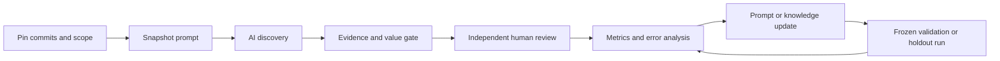

# Methodology

## Objective

The experiment optimizes for **verified, high-value defects per reviewed candidate**, not raw finding volume. Compiler review is especially prone to attractive false positives because internal IR accepts states that the public producer never creates, and because legal optimizations may intentionally differ from source-level intuition.

The central hypothesis after rounds 001 and 002 is:

> Requiring supported-input reachability, an executable semantic oracle, candidate-specific reproducers, and an explicit value judgment will preserve real parser and miscompilation findings while suppressing synthetic IR, intended-behavior reports, and low-value boundary distractions.

This is falsifiable. Keep scope and target commits fixed, run prompt variants, review them blind to prompt identity when practical, and compare precision, yield, unreachable false positives, and holdout recall.

## Pipeline

Discovery and judgment are visible in the same `report.md`: the AI fills the candidate sections and the human fills the marked judgment sections. This repository does not require a machine scoring layer; the human decision is the oracle.

The Python helper does not invoke a model. It creates an experiment envelope only. Model execution is performed manually through VS Code Copilot Agent mode, which reads the run's prompt and manifest, investigates the pinned checkout with its normal tools, and writes the Markdown report.

## Three Proof Obligations

### 1. Reachability

Prove that supported public input reaches the suspicious path.

- Warpo frontend: valid supported AssemblyScript/TypeScript is strongest.
- Warpo internal pass: trace the frontend-produced IR. Hand-written WAT alone does not establish a Warpo bug when the pass has a narrower producer contract.
- wasm-compiler: valid supported Wasm is public input, so WAT assembled by a standard tool is acceptable.
- End-to-end: Warpo output at the pinned commit becomes wasm-compiler input without manual IR edits.

Reachability is an internal admission check rather than a separate report field. Report only candidates with a minimal supported input that reaches and triggers the fault; omit producer-unreachable hypotheses.

### 2. Contract Violation

Name the rule that observed behavior violates: language semantics, WebAssembly validation, documented behavior, an existing invariant, or differential agreement with a trusted engine. Check tests, comments, docs, history, and adjacent implementations for intentional behavior.

### 3. Trigger And Oracle

Execute a minimal input on the unmodified baseline and record the command, exit code, and focused output. Prefer independent oracles:

- expected diagnostic instead of abort;
- WebAssembly validator acceptance/rejection;
- observable return value, side-effect order, or trap;
- differential execution against `wasm-interp` or another conforming engine;
- before/after IR plus runtime behavior for optimization passes.

Code inspection alone may produce a `defer` candidate, never an `accept`.

## Verdict Policy

| Decision | Verdict | Meaning | Typical action |
| --- | --- | --- | --- |
| `accept` | `actionable_bug` | Reachable, reproduced semantic or robustness failure with meaningful user impact | Fix and add regression test |
| `downgrade` | `robustness_only` | Correct invariant observation without demonstrated supported-input impact | Assert, document, or harden |
| `defer` | `insufficient_evidence` | A decisive check is unavailable or inconclusive | Record the missing experiment |

The AI omits rejected hypotheses from Candidate Findings. The human may still reject any reported candidate during review.

Value is independent of decision. Rate ordinary valid-input crashes, miscompilations, invalid output, and clear evaluation-semantic failures as high value. Rate issues requiring extreme boundary values, conspicuously erroneous input, or narrow robustness conditions as low value. A potentially severe issue without decisive contract evidence remains deferred with unknown value.

## Iterating Prompts Without Leakage

1. Freeze scope, target commits, model settings, budget, and prompt before a run.
2. Use stable IDs for reported candidates. Omit AI-rejected hypotheses and summarize unsuccessful search only at the area level.
3. Have a human review evidence rather than model rhetoric.
4. Diagnose errors by category: missed reachability check, misunderstood design, weak oracle, duplicate, or search miss.
5. Change one prompt mechanism at a time when possible.
6. Re-run known training cases only as a regression check.
7. Select prompts on a frozen validation set.
8. Open the holdout only after choosing the prompt. Do not paste holdout labels back into the prompt until that evaluation cycle is closed.

Use multiple seeds or repeated runs when model sampling is nondeterministic. Report the distribution, not only the best run. Keep token/time budgets equal when comparing strategies.

## Search Strategy

Partition searches by ownership boundary rather than scanning the whole repository in one conversation:

1. parser and diagnostic recovery;
2. source evaluation order and lowering;
3. optimization semantic preservation;
4. Wasm parsing, validation, and feature gates;
5. architecture-specific code generation;
6. compiler/runtime ABI, memory, and trap behavior;
7. repeated compile/instantiate/reset state;
8. Warpo-to-wasm-compiler differential pipeline.

For each bounded scope, require the agent to report areas checked with no finding. This makes search coverage auditable and helps identify blind spots.

## Open-Source Patterns Used

The repository borrows mechanisms, not domain content, from these projects:

- [SWE-bench](https://github.com/SWE-bench/SWE-bench): immutable task identities, pinned code, container-oriented reproducibility, per-run logs, and separate fail-to-pass/pass-to-pass tests. Applied here as pinned submodules, immutable run envelopes, focused failure oracles, and control tests.
- [Magma](https://hexhive.epfl.ch/magma/docs/technical.html): ground-truth canaries distinguish a bug location being **reached** from its fault condition being **triggered**. Applied here as an internal reachability gate followed by an observed oracle in the report.
- [Semgrep rule testing](https://semgrep.dev/docs/writing-rules/testing-rules): positive and negative fixtures make both detection and false-positive behavior explicit. Applied here through a nearby control for each reported candidate without surfacing rejected hypotheses as findings.
- [OSS-Fuzz ideal integration](https://google.github.io/oss-fuzz/advanced-topics/ideal-integration/): checked-in targets, coverage-oriented seed corpora, reproducible testcases, and promotion of found failures into regression tests. Applied here through local minimal artifacts and permanent human supervision labels.
- [OSS-Fuzz reproduction workflow](https://google.github.io/oss-fuzz/advanced-topics/reproducing/): reproduce on an exact build before fixing and rerun the testcase after repair. Applied here as mandatory baseline command evidence.
- [Inspect AI](https://inspect.aisi.org.uk/tasks.html): separate dataset, solver, and scorer; parameterized evals; stable sample IDs; complete run logs and re-scoring. Applied here as separate prompt, candidates, human review, and metrics files.
- [wasm-compiler differential fuzzer](../upstream/wasm-compiler/fuzz/reference/main.cpp): generates Wasm with `wasm-opt` and obtains reference behavior with `wasm-interp`. Reuse this existing oracle for compiler/runtime candidates instead of inventing a parallel interpreter.
- [wasm-compiler AFL++ harness](../upstream/wasm-compiler/fuzz/afl_harness/Readme.md): preserves crash inputs and provides a direct replay command. Feed minimized, deduplicated failures into AI analysis and regression cases.

The first implementation intentionally uses standard-library Python and JSON files. Adopt a larger framework such as Inspect only when model invocation, sandbox concurrency, or log volume makes the local harness insufficient.

## Supervision Promotion Rules

A human-confirmed finding should move from a run into the supervision set only after:

1. baseline behavior is reproduced at the recorded commit;
2. the supported input boundary is established;
3. the reproducer is independently minimized in a candidate-specific source file and stored or deterministically generated;
4. an independent oracle exists;
5. a nearby negative/control case exists;
6. sensitive or bulky artifacts are removed;
7. the case receives a stable ID and split assignment.

Do not train on a validation or holdout label during the same evaluation cycle.